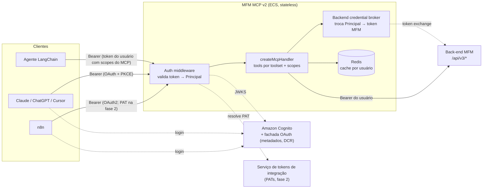

# MFM MCP v2 — Especificação

Documento-base para gerar o MCP novo do zero. Escrito a partir da auditoria do MCP atual (commit `5fd3960`) e de pesquisa sobre a especificação MCP e servidores de referência (GitHub, Stripe, Atlassian, Sentry, Linear, Supabase) em set/2026.

## 1. Objetivos e metas mensuráveis

| Meta | Hoje | Alvo |
|---|---|---|
| Tokens do `tools/list` com todos os toolsets | ~24,5 mil (51 tools) | ≤ 4,5 mil (≤ 20 tools) |
| Tokens do `tools/list` só com o toolset `core` | ~8,9 mil | ≤ 2,5 mil |
| Tools de leitura sem `readOnlyHint: true` | 14 | 0 |
| Resposta típica de tool | até ~24 mil tokens | ≤ 2 mil (padrão), teto de 8 mil |
| Estado de usuário em variável global | permissões, token, fila de 401 | nenhum |
| Chaves de cache sem identidade do usuário | todas | nenhuma |
| Mecanismos de autenticação | 6 (alguns inseguros) | 3 padronizados (OAuth, token exchange, PAT) |

**Fora do escopo desta versão:** MCP Apps (UI renderizada no cliente), extensão Tasks, prompts de MCP como guia para agentes (vão para skills do agente).

## 2. Decisões

| Tema | Decisão |
|---|---|
| Protocolo | Especificação `2026-07-28` (stateless, sem sessão), atendendo também clientes das versões 2025 pelo mesmo endpoint |
| SDK | `@modelcontextprotocol/server` v2 + `@modelcontextprotocol/node`, zod ^4.2 |
| Papel do MCP na autenticação | Apenas resource server: valida tokens, não emite tokens nem recebe senhas |
| Servidor de autorização | Amazon Cognito (user pool existente) + fachada OAuth fina para o que o Cognito não tem (seção 5.1) |
| Chamadas ao back-end MFM | O MCP troca o token do principal por um token MFM do mesmo usuário (seção 5.5) |
| Clientes na v1 | Agente LangChain, Claude Desktop e claude.ai, ChatGPT, Cursor, n8n |
| Cadastro | `save_entity` + `describe_entity_type`, validação no servidor |
| Autorização | Duas camadas: scope OAuth limita o que o **cliente** pode fazer em nome do usuário; papel por nó da hierarquia (owner, admin, viewer…) define o que o **usuário** pode fazer em cada local. Vale a interseção, decidida pelo back-end (seções 5.6 a 5.8) |
| Escrita | Habilitada, exige scope `mfm:write` e capacidade no nó; tools destrutivas anotadas para confirmação no cliente |
| Idioma | Inglês em nomes, descrições, schemas, mensagens de erro e `instructions` |
| Transporte local | stdio só para desenvolvimento, autenticado por access token do Cognito em variável de ambiente, obtido por um script de login no navegador (sem tool de login) |

## 3. Stack

- Node 24, TypeScript com `strict`, ESM.
- `@modelcontextprotocol/server` e `@modelcontextprotocol/node` (v2). Rodar o codemod e o guia oficial de migração como referência: `npx @modelcontextprotocol/codemod@latest v1-to-v2`.
- `createMcpHandler(factory)` com o modo legado stateless ligado, exposto via `toNodeHandler`.
- `zod` ^4.2 (schemas como Standard Schema, não raw shapes).
- `jose` para validar JWT (JWKS com cache).
- `ioredis` para cache e para o cache de tokens MFM. Instância ou database separada do cache de dados, sem eviction para dados de autenticação.
- `pino` para logs, OpenTelemetry para traces e métricas.
- Cliente HTTP do back-end sem estado global (uma instância com o token passado por chamada, sem interceptor de refresh compartilhado).

## 4. Arquitetura



Regras:
- Nenhum estado de usuário fora do contexto da requisição. O `Principal` chega ao handler pelo contexto do SDK (`ctx`), nunca por variável de módulo.
- Qualquer instância atende qualquer requisição (sem sticky session). Estado entre chamadas, se necessário, vai em handles opacos assinados e vinculados ao `sub`.
- O back-end MFM continua sendo a autoridade de permissão sobre dados. O MCP só aplica scopes e não duplica regras de acesso por nó; usa as capacidades que o back-end devolve para orientar o agente (seção 5.8).

## 5. Autenticação e autorização

### 5.1 Servidor de autorização: Amazon Cognito

O Cognito cobre login (Managed Login / Hosted UI), authorization code com PKCE, clientes públicos, `client_credentials`, scopes customizados e customização de claims (Lambda de pre token generation). Ele **não** tem nativamente: token exchange RFC 8693, DCR/CIMD, metadados RFC 8414 com `registration_endpoint` e o parâmetro `resource` (RFC 8707). O desenho:

- **Resource server do MCP no user pool**, com identificador igual à URL do MCP e scopes `mfm:read`, `mfm:write`, `mfm:admin`. No access token eles aparecem como `https://mcp.<dominio>/mcp/mfm:read`. O access token do Cognito não tem `aud`; esse prefixo de scope, somado a uma allowlist de `client_id`, faz o papel de audience.
- **App clients pré-registrados**, um por tipo de cliente: web app/agente, Claude, ChatGPT, Cursor, n8n, cada um com seus callbacks. Nada de criar app client por requisição.
- **Fachada OAuth fina** (rotas no próprio MCP ou API Gateway + Lambda), sem receber senha:
  - `/.well-known/oauth-authorization-server` com `authorization_endpoint` e `token_endpoint` do domínio do Cognito e `registration_endpoint` da fachada.
  - `/register` (DCR de compatibilidade): valida `redirect_uris` contra a allowlist e devolve o `client_id` pré-registrado correspondente. Fora da allowlist: 400.
  - Se o Cognito rejeitar o parâmetro `resource` que Claude e ChatGPT enviam, a fachada faz proxy de `/authorize` e `/token` removendo-o (validar na PoC).
- **Pre token generation (V2)** coloca no access token as claims que o MCP e o back-end precisam (ex.: id do usuário no MFM).
- `client_credentials` do Cognito é cobrado por token emitido: cachear até expirar.
- Referências: `aws-samples/sample-multi-tenant-saas-mcp-server` (DCR e metadados sobre Cognito) e `aws-samples/sample-cognito-oauth2-token-exchange` (RFC 8693 sobre Cognito).

Allowlist de redirect URIs: `https://claude.ai/api/mcp/auth_callback`, `https://chatgpt.com/connector_platform_oauth_redirect`, `https://www.cursor.com/agents/mcp/oauth/callback`, loopback `http://localhost:*` e `http://127.0.0.1:*`, callback do n8n.

### 5.2 Metadados e respostas HTTP

- `GET /.well-known/oauth-protected-resource` (e o sufixo `/mcp`):

```json
{
  "resource": "https://mcp.<dominio>/mcp",
  "authorization_servers": ["https://<idp>/"],
  "scopes_supported": ["mfm:read", "mfm:write", "mfm:admin"],
  "bearer_methods_supported": ["header"]
}
```

- Toda resposta 401 (token ausente, inválido ou expirado) traz `WWW-Authenticate: Bearer resource_metadata="https://mcp.<dominio>/.well-known/oauth-protected-resource", scope="mfm:read"`.
- Scope insuficiente: 403 com `error="insufficient_scope"` e o scope necessário.
- Token só no header `Authorization`. Nunca em query string ou argumento de tool.
- Validar `Origin` (403 se inválido), CORS com allowlist, limite de tamanho do corpo e rate limit por principal.

### 5.3 Validação do token

1. Access token do Cognito: assinatura via JWKS, `iss` do user pool, `token_use = access`, `client_id` na allowlist, `exp`, e pelo menos um scope do resource server do MCP.
2. PAT (`mfm_pat_...`, fase 2): consultado no serviço de tokens de integração pelo hash; precisa estar ativo, dentro da validade e com scopes.
3. Qualquer outro token: 401. Não existe passthrough do token do back-end.

Resultado, sempre o mesmo formato:

```ts
type Principal = {
  sub: string;             // id do usuário no MFM
  clientId: string;        // quem está chamando (claude, n8n, agente...)
  scopes: Set<"mfm:read" | "mfm:write" | "mfm:admin">;
  actor?: string;          // agente que age em nome do usuário (claim act)
  authMethod: "oauth" | "token_exchange" | "pat" | "client_credentials";
};
```

O `Principal` não carrega clientes, papéis nem permissões por nó. Com milhares de nós o token estouraria o limite do Cognito, e a lista ficaria desatualizada até o token expirar quando alguém mudasse um papel.

### 5.4 Como cada cliente autentica

| Cliente | Fluxo |
|---|---|
| Agente LangChain | **Fase 1:** o web app pede também os scopes do MCP no login; o back-end do agente envia o access token do usuário, que já foi emitido com scopes do resource server do MCP. **Fase 2** (quando precisar de escopo mínimo e identidade do agente no token): serviço de troca RFC 8693 sobre Cognito, emitindo token curto com `sub` do usuário e `act` do agente |
| Claude Desktop e claude.ai | Descobre o Cognito pelo 401 + protected resource metadata, registra pela fachada (DCR) e faz OAuth com PKCE |
| ChatGPT e Cursor | Mesmo fluxo OAuth, com os callbacks deles na allowlist |
| n8n | **Fase 1:** fluxo MCP OAuth2 do próprio n8n com app client pré-registrado. **Fase 2:** PAT no header `Authorization: Bearer` |
| Serviço para serviço | `client_credentials` com scopes; permissões de "service principal" no back-end |
| stdio (dev local) | Access token do Cognito na variável `MFM_ACCESS_TOKEN`, obtido por `npm run login` (authorization code + PKCE no navegador) |

PATs (fase 2, o Cognito não emite): emitidos pelo usuário numa tela do web app ("Tokens de integração"), com nome, scopes e expiração obrigatória, exibidos uma única vez, guardados só como hash, revogáveis e com prefixo fixo `mfm_pat_` (permite secret scanning).

### 5.5 Credencial para o back-end MFM

O MCP nunca repassa o token recebido do cliente. Para cada principal:

1. O broker troca o token do principal (ou, no caso de PAT e `client_credentials`, uma asserção do próprio MCP com o `sub`) por um **token MFM do mesmo usuário** num endpoint de token exchange do back-end/IdP. O token MFM carrega os scopes concedidos ao cliente (para o back-end aplicar o teto da seção 5.6) e **não** carrega papéis por nó: o back-end consulta os papéis a cada requisição, para que uma revogação valha na hora.
2. O token MFM fica em cache cifrado no Redis, com chave `sub` + `clientId`, até `exp - 60s`.
3. 401 do back-end: descarta o cache daquele principal e tenta uma vez. Se falhar de novo, erro de tool pedindo nova autenticação. Sem fila global de refresh.

**Dependência do time de back-end:** endpoint de troca no próprio back-end MFM (formato RFC 8693), autenticado pelas credenciais do MCP, que valide o access token do Cognito (JWKS, `client_id` na allowlist, scope do MCP) e devolva um token MFM curto do mesmo usuário. É código do back-end, não do Cognito: ele já emite o JWT do MFM hoje.

### 5.6 Camada 1: scopes OAuth (teto do cliente)

Scope responde "o que este **aplicativo** pode fazer em nome do usuário", não "onde o usuário pode mexer". É grosso de propósito e igual para toda a hierarquia.

- Cada tool declara o scope que exige (seção 6.3). Sem o scope, a tool **nem aparece** no `tools/list` daquele principal.
- Leitura: `mfm:read`. Criação e edição: `mfm:write`. Exclusão: `mfm:write` + anotação destrutiva. Gestão de permissões e usuários: `mfm:admin`.
- Negar por padrão: tool sem scope declarado não é registrada.
- O scope só reduz: um owner que conectou o Claude só com `mfm:read` não escreve por ali; um viewer com `mfm:write` continua sem escrever onde é viewer.

### 5.7 Camada 2: papéis por nó da hierarquia (autoridade do usuário)

Modelo de dados no back-end (já existe hoje em `/api/v3/permissions/me` + `/api/v3/permissions-json`; a v2 formaliza as regras):

- **Hierarquia:** árvore de nós `customer > loc1 > loc2 > … > plant > asset > sensor`, com profundidade variável. Todo nó tem `parentId` e o back-end consegue obter a cadeia de ancestrais de qualquer nó.
- **Atribuição de papel** (`role binding`): `(userId, nodeId, role)`. Um usuário pode ter várias: owner no cliente A, viewer no cliente B, admin só na `loc3` do cliente C.
- **Papel → capacidades:** cada papel (hoje `customerOwner`, `customerViewer`, `plantOwner`, `totalPlantAdmin`, `plantAdminWTicket`, `plantAdminWThreshold`, `plantAdmin`, `plantViewer`, `mantenedor`) mapeia para um conjunto fixo de capacidades. A tabela vive só no back-end (`permissions-json`); o MCP não copia.
- **Capacidades** (vocabulário estável exposto ao MCP): `read`, `create`, `update`, `delete`, `update_firmware`, `delete_firmware`, `manage_thresholds`, `manage_events`, `manage_tickets`, `manage_permissions`, `manage_subscriptions`.
- **Herança para baixo:** uma atribuição no nó N vale para N e toda a subárvore. A capacidade efetiva num nó X é a **união** das capacidades de todas as atribuições em X e nos seus ancestrais (viewer no cliente + admin na `loc2` = admin em toda a subárvore da `loc2`, viewer no resto do cliente). Sem regras de negação explícita na v1.
- **Sem herança para cima:** quem tem papel só na `loc3` não lê dados da `loc2` nem do cliente. Os ancestrais aparecem apenas como trilha de navegação (id e nome), sem dados, contagens ou eventos deles.
- **Administradores globais** (`$_ADMINISTRATORS`): todas as capacidades em todos os nós, sujeitos ainda ao scope do cliente.
- **Regra de criação:** criar um nó exige `create` no **pai**. Editar exige `update` no próprio nó. Mover um nó exige `update` na origem e `create` no novo pai.
- **Negar por padrão:** ação sem mapeamento para capacidade é negada (o `authorization.ts` atual libera ações desconhecidas, e isso não passa para a v2).

Decisão por requisição, sempre no back-end: `permitido = scope do cliente cobre a ação ∧ capacidade efetiva do usuário no nó alvo inclui a ação`.

**Contrato exigido do back-end** (ponto em aberto na seção 20):

1. Todo endpoint de leitura filtra pela capacidade `read` efetiva (listas só trazem nós acessíveis; buscas também).
2. Todo endpoint de escrita checa a capacidade no nó alvo (ou no pai, na criação) e o scope do token MFM.
3. Respostas de entidade trazem `allowedActions` do usuário que chamou naquele nó (padrão de `viewerPermission` do GitHub e `capabilities` do Google Drive).
4. `GET /permissions/me/summary`: atribuições do usuário (até 25, com `totalCount`), `isGlobalAdmin`, as capacidades que ele tem em **algum** nó (ex.: `canWriteSomewhere`) e `permissionsVersion`, número que muda sempre que um papel do usuário é alterado.
5. Filtro por capacidade na busca (`can=update`) para perguntas como "onde posso cadastrar um motor?".

A lógica de herança fica numa função única no back-end, usada por todos os endpoints. Se o modelo crescer (grupos de usuários, negação explícita, compartilhamento pontual), avaliar um motor de políticas: Amazon Verified Permissions (Cedar, entidades com pais, integra com Cognito) ou OpenFGA (modelo Zanzibar, herança por relação).

### 5.8 Como o MCP usa as permissões

- **Não decide acesso.** Nenhuma tool checa papel ou capacidade antes de chamar o back-end; o MCP só repassa o que o back-end decide.
- **Orienta o agente.** `get_entity` devolve `allowedActions` e `role` (papel efetivo e nó de onde ele vem); `get_context` devolve o resumo de atribuições. O agente não propõe cadastro onde o usuário não pode, e explica o motivo.
- **Esconde o que não cabe.** No `tools/list`, tools de escrita só aparecem se o principal tiver o scope **e** `canWriteSomewhere` for verdadeiro (um viewer em toda a hierarquia não vê `save_entity`). A lista de tools passa a ser privada por usuário (`cacheScope: "private"`).
- **Recurso sem acesso de leitura** (inclusive por instrução do usuário ou por texto injetado em dados): o back-end nega, a tool devolve `NOT_FOUND` com "not found or not accessible" (sem confirmar se o recurso existe) e dica de não tentar de novo.
- **Recurso visível, ação não permitida** (ex.: viewer tentando editar): `PERMISSION_DENIED` com o papel efetivo e a capacidade que faltou, o que o usuário já pode ver na tela e não vaza nada.
- **Registro:** toda negação vai para log com `sub`, `clientId`, tool, nó e capacidade pedida; repetição gera alerta.
- Nenhuma tool aceita tenant/customer como forma de ampliar acesso: sem escopo, usa os nós acessíveis do principal; com escopo, o back-end valida.

Exemplo, usuário com viewer no cliente A, owner no cliente B e plantAdmin só na `loc3` do cliente C, conectado pelo Claude com `mfm:read mfm:write`:

| Pedido | Resultado |
|---|---|
| Eventos do cliente A | permitido (`read` herdado do cliente) |
| Editar um motor do cliente A | `PERMISSION_DENIED`: "Your role here is customerViewer; update is not allowed." |
| Cadastrar ativo sob a `loc3` do cliente C | permitido (`create` na `loc3`) |
| Overview da `loc2` do cliente C | `NOT_FOUND` (sem herança para cima) |
| Excluir modelo do cliente B pelo mesmo usuário conectado só com `mfm:read` | tool nem aparece (scope) |

## 6. Catálogo de tools

### 6.1 Convenções

- Nomes em `snake_case`, verbo + substantivo, até 64 caracteres, só `[a-z0-9_]`, sem prefixo `mfm_` (os clientes já prefixam pelo nome do servidor).
- Verbos fixos: `get_` (um item ou agregado), `find_` (busca com filtros), `list_` (lista ranqueada), `save_` (criar ou atualizar), `delete_`, `describe_` (schema ou metadados), `edit_` (lote de operações).
- `title` legível em inglês ("Get events").
- Descrição: até ~300 caracteres. Diz o que a tool faz, quando usar em vez das vizinhas e o que devolve. Sem tutorial, sem endpoint HTTP, sem repetir o que o schema já diz, sem instruções de comportamento para o modelo.
- Parâmetros com nomes explícitos (`deviceIds`, não `id` genérico) e descrição só quando o nome não basta.

### 6.2 Presets de anotação

| Preset | `readOnlyHint` | `destructiveHint` | `idempotentHint` | `openWorldHint` |
|---|---|---|---|---|
| `READ` | true | false | true | false |
| `CREATE_OR_UPDATE` | false | false | true | false |
| `DESTRUCTIVE` | false | true | true | false |

Toda tool usa um preset. Um teste falha se alguma tool não tiver anotações completas.

### 6.3 Toolsets e seleção

- Toolsets: `core` (sempre ligado), `register`, `dashboards`.
- Seleção pelo cliente: header `X-MCP-Toolsets: core,register` ou caminho `/mcp/x/core,register`. Padrão: `core`. `?read_only=true` ou header `X-MCP-Readonly: true` esconde tudo que não for `READ`.
- A seleção nunca amplia permissões: o filtro de scopes (5.6) e o de `canWriteSomewhere` (5.8) são aplicados depois.

### 6.4 Tools (19)

**core** (scope `mfm:read`, preset `READ`)

| Tool | Parâmetros | Devolve | Substitui |
|---|---|---|---|
| `get_context` | — | usuário, idioma e unidades, scopes da conexão, `accessScope` (`all` para admin global ou `limited`), `canWriteSomewhere`, `customerCount` e as atribuições de papel (nó id, nome, tipo, papel) só quando forem até 25 | `mfm-whoami` |
| `find_entities` | `type?` (enum de tipos), `under?` (id de qualquer ancestral), `search?`, `health?[]`, `can?` (capacidade, ex.: `create`, para "onde posso cadastrar"), `limit` (20, máx. 100), `cursor?` | id, nome, tipo, parentId, health, `nextCursor` | `list_entities` (modo padrão), `motorscan_info` |
| `get_entity` | `id` | entidade completa: atributos, ancestrais com nomes, gateway, `modelId`, atributos medíveis, `role` efetivo (e nó de onde vem) e `allowedActions` | `list_entities` com id ou modo verbose |
| `get_overview` | `customerIds?[]`, `plantIds?[]`, `sections[]` (enum: health, inventory, connectivity, events, diagnosis, comparison; padrão health), `days` (7, máx. 90) | agregados da conta ou do escopo | `get_hierarchy_overview`, `get_general_overview` |
| `list_critical_assets` | `customerIds?[]`, `plantIds?[]`, `deviceTypes?[]`, `health?[]`, `search?`, `limit`, `cursor?` | dispositivos do pior para o melhor estado | `get_acd_overview` |
| `get_events` | `entityIds?[]` (cliente, planta, ativo, agrupador ou sensor; filhos incluídos), `state[]` (padrão new, acknowledged), `level?[]`, `eventType?`, `search?`, `from?`, `to?`, `limit`, `cursor?` | eventos, mais recentes primeiro | `get_events` |
| `get_timeseries` | `deviceIds[]` (1 a 10), `attributes?[]` (máx. 10; omitido = lista os atributos disponíveis), `from?`, `to?`, `aggregation` (padrão MAX), `maxPoints` (100; 0 = só estatísticas) | por atributo: min, max, média, último + pontos reduzidos | `get_timeseries` |
| `get_thresholds` | `deviceIds[]` (1 a 20), `onlyEnabled` (padrão true) | limites de alerta e crítico por atributo | `get_thresholds` |
| `get_threshold_coverage` | `under`, `deviceType?`, `status?`, `limit` (50), `cursor?` | cobertura de thresholds sob uma entidade | `get_threshold_stats` |
| `get_audit_log` | `assetId?` ou `customerId?` (+ `plantId?`), `from?`, `to?`, `limit` (30), `cursor?` | quem mudou o quê, mais recentes primeiro, com `entryId` | `get_audit_events`, `get_asset_timeline` |
| `get_audit_entry` | `entryId` | valores antigos e novos por campo | `get_audit_detail` |

**register** (scope `mfm:write`)

| Tool | Preset | Parâmetros | Substitui |
|---|---|---|---|
| `describe_entity_type` | `READ` | `type` | schemas inline dos 24 `manage_*`, prompts e resources de cadastro |
| `save_entity` | `CREATE_OR_UPDATE` | `type`, `id?` (sem id = cria), `parentId?` (obrigatório na criação), `name?`, `description?`, `fields` (objeto validado no servidor contra o schema do tipo) | os 24 `manage_*` |
| `lookup_motor_by_serial` | `READ` | `serialNumber` | mesma tool, devolvendo campos já no formato de `save_entity` |

**dashboards** (scope `mfm:write` para escrita)

| Tool | Preset | Parâmetros | Substitui |
|---|---|---|---|
| `find_models` | `READ` | `customerId?`, `id?`, `type?` | `list_models`, `get_model` |
| `save_model` | `CREATE_OR_UPDATE` | `id?`, `customerId?`, `name?`, `type?`, `protocol?`, `endianess?`, `dataSendFrequency?`, `registers?[]` | `manage_model` |
| `delete_model` | `DESTRUCTIVE` | `id` | `delete_model` |
| `get_dashboards` | `READ` | `modelId`, `dashboardId?`, `verbose` | `list_dashboards` |
| `edit_dashboards` | `DESTRUCTIVE` | `modelId`, `ops[]` (união por `op`: create, rename, delete dashboard; add, update, remove, move block), aplicadas numa única gravação | as 7 tools de dashboard e bloco |

**Removidas:** `cache_stats` (vira métrica em OpenTelemetry), `motorscan_info` (a frase útil vai para a descrição de `save_entity`), `mfm-login`, `mfm-logout`.

### 6.5 Regras de `save_entity`

- Permissão (decidida pelo back-end): criação exige `create` no `parentId`; atualização exige `update` no `id`; troca de `parentId` exige também `create` no novo pai.
- Criação: valida `fields` contra o schema completo do tipo.
- Atualização: aceita **só os campos alterados** (validação parcial) e mescla com o registro atual no servidor. Nunca exige campos obrigatórios da criação.
- Os schemas por tipo são gerados das definições zod já existentes em `src/modules/register/tools/**/schema.ts`, corrigindo tipos: booleanos reais, números como número, enums no lugar de texto livre e objetos tipados no lugar de "JSON string".
- Erro de validação devolve a lista de campos com problema e o schema compacto do tipo, para o agente corrigir na chamada seguinte.

## 7. Convenções de entrada

- Datas em ISO 8601 (`from`, `to`). Janelas em `days`. Nada em milissegundos.
- Listas sempre como array (sem `string | string[]`).
- Paginação por `limit` + `cursor` opaco. `limit` padrão 20, máximo 100.
- Enums para todo valor fechado. Booleanos como boolean.
- Padrões sensatos que dispensam ids: sem escopo, a tool usa os clientes acessíveis do principal.

### 7.1 Escopos grandes (admins com milhares de clientes)

- **Nenhuma lista sem limite.** `limit` padrão 20, máximo 100, sempre com `totalCount` e `nextCursor`.
- **Busca no back-end, não no MCP.** `find_entities` repassa `search`, `type` e `under` para a API, que filtra e ordena (nome com índice, correspondência por prefixo e por trecho). O MCP nunca baixa tudo para filtrar em memória.
- **Resposta que orienta.** Busca sem filtros num escopo grande devolve a primeira página, o `totalCount` e `hint: "1,243 customers; narrow with search or type"`.
- **Agregação no escopo "tudo".** Se o principal tem acesso a mais de 50 clientes e a chamada não traz escopo, `get_overview` usa endpoint agregado do back-end (totais da conta), e `get_events`, `list_critical_assets` e `get_audit_log` exigem `entityIds`/`customerId`, devolvendo `INVALID_ARGUMENT` com a dica "You can access 1,243 customers; pass entityIds (use find_entities)".
- **Contexto da tela primeiro.** No agente do produto, o cliente/ativo aberto na tela vai no contexto da requisição, então a maioria das perguntas nem precisa de busca.
- **Desambiguação.** Busca por nome com vários resultados devolve os melhores candidatos (id, nome, planta/cliente pai), e o agente pergunta ao usuário qual é, em vez de escolher sozinho.
- **Itens enxutos.** Cada item de lista tem só id, nome, tipo, pai e health (~15 tokens); 100 itens ficam em ~1,5 mil tokens.

## 8. Convenções de saída

- `content`: um bloco de texto com JSON **compacto**, sem nulls e sem campos vazios. É o que o LangChain entrega ao modelo.
- `structuredContent` + `outputSchema` nas tools do `core`, para clientes que usam dados estruturados.
- Nomes legíveis ao lado dos ids (`deviceId` + `deviceName`).
- Listas trazem `nextCursor` quando há mais itens e `truncated: true` com uma dica curta ("narrow with from/to or entityIds") quando houver corte.
- Orçamento: ~2 mil tokens no padrão, teto de 8 mil. `get_timeseries` devolve estatísticas + no máximo `maxPoints` por atributo.
- Sem texto explicativo fixo na resposta (`usage`, `aggregationExplanation`, resumos com emoji).

## 9. Erros

Resultado de tool com `isError: true` e corpo:

```json
{ "error": { "code": "NOT_FOUND", "message": "Entity 'abc' not found.", "hint": "Search ids with find_entities.", "retryable": false } }
```

| Situação | `code` | Dica para o agente |
|---|---|---|
| Validação de entrada | `INVALID_ARGUMENT` | lista `fields` com o problema de cada um |
| Back-end 403 ou 404 em recurso sem `read` | `NOT_FOUND` | "Not found or not accessible. Do not retry; search ids with find_entities." (não revela se existe) |
| Back-end 403 em ação sobre recurso visível (ex.: viewer editando) | `PERMISSION_DENIED` | "Your role on 'Plant X' is plantViewer; 'update' is not allowed. Do not retry." com `role`, `requiredCapability` e `nodeId` no corpo |
| Scope da conexão não cobre a ação | `PERMISSION_DENIED` | "This connection was granted read-only access. Reconnect with write access." |
| Back-end 409/422 | `CONFLICT` / `INVALID_ARGUMENT` | campos rejeitados |
| Back-end 429, 5xx, timeout | `UNAVAILABLE` | `retryable: true` |
| Credencial MFM expirada e troca falhou | `UNAUTHENTICATED` | "Re-authenticate the connection." |

Nunca devolver corpo cru do back-end, stack trace ou "Unexpected error". Não mascarar erro como ausência de dado (ex.: 403 virando "no thresholds configured").

## 10. Instructions do servidor

Enviadas no discover/initialize. Rascunho (≤ 1.500 caracteres, o essencial nos primeiros 512):

```text
MFM industrial asset monitoring: customers > sites > plants > assets (motors, pumps, fans, panels...) > sensors and gateways.
Start with get_context to know the user and accessible customers; tools default to all accessible customers when no scope is given.
Resolve ids with find_entities (by name/type/parent) or lookup_motor_by_serial; never guess ids.
Judge asset health against get_thresholds, not generic limits. Use get_timeseries with maxPoints=0 for a quick summary before fetching points.
Events: get_events (open ones by default). Who changed what: get_audit_log, then get_audit_entry for field details.
Writes: call describe_entity_type before the first save_entity of a type; on update send only changed fields.
Permissions differ per node: check allowedActions from get_entity before proposing a write; on PERMISSION_DENIED or NOT_FOUND tell the user, do not retry.
```

## 11. Prompts e resources

- Nenhum resource na v1 (substituídos por `describe_entity_type` e `get_entity`).
- Prompts opcionais só como atalhos para usuários humanos em Claude/Cursor, no máximo dois: `diagnose_asset` e `build_dashboard`, com corpo curto.
- Os guias de domínio atuais (timeseries, thresholds, auditoria, overview) viram **skills do agente LangChain**, não conteúdo do MCP.

## 12. Cache

- Chave: `mfm:{env}:v2:{sub}:{permissionsVersion}:{tool}:{hash(args normalizados)}`. Nunca sem `sub`. O `permissionsVersion` (seção 5.7) faz uma mudança de papel invalidar na hora todo o cache daquele usuário, sem esperar TTL; o MCP o lê do resumo de permissões, com cache de até 30 s.
- TTLs por tool (ex.: overview 60 s fresco / 300 s stale, entidades 300 s / 900 s, timeseries 30 s).
- Escrita invalida só o cache do tenant afetado, não o cache global.
- Listas de tools com `cacheScope: "private"` quando dependem de scopes do principal.

## 13. Observabilidade e auditoria

- Spans seguindo as convenções OpenTelemetry para MCP: nome `{mcp.method.name} {target}`, atributos `mcp.method.name`, `gen_ai.tool.name`, `gen_ai.operation.name=execute_tool`, `mcp.protocol.version`, mais `enduser.id` (sub), `client_id` e toolsets ativos.
- Métricas: chamadas, erros por `code`, latência, tamanho da resposta em tokens estimados, trocas de token e hit rate do cache.
- Logs estruturados sem tokens, senhas ou corpos de resposta do back-end.
- Toda escrita gera registro de auditoria com `sub`, `actor`, `clientId`, tool, argumentos (sem segredos) e resultado.

## 14. Configuração

| Variável | Uso |
|---|---|
| `MCP_PUBLIC_URL` | URL canônica do recurso (usada em `aud` e nos metadados). Obrigatória, sem fallback para header `Host` |
| `MFM_API_URL` | Back-end. Obrigatória, sem padrão apontando para develop |
| `MFM_TOKEN_EXCHANGE_URL`, `MCP_CLIENT_ID`, `MCP_CLIENT_SECRET` | Broker de credencial para o back-end |
| `PAT_SERVICE_URL` | Resolução de PATs (fase 2) |
| `REDIS_URL`, `REDIS_TOKEN_CACHE_URL` | Cache de dados e cache de tokens (separados) |
| `CORS_ALLOWED_ORIGINS`, `RATE_LIMIT_*` | Proteções HTTP |
| `OTEL_*` | Telemetria |
| `COGNITO_USER_POOL_ID`, `COGNITO_DOMAIN`, `COGNITO_ALLOWED_CLIENT_IDS` | Validação de token e fachada OAuth |
| `MFM_ACCESS_TOKEN` | Somente stdio em desenvolvimento |

Configuração validada com zod na inicialização; o processo não sobe se faltar algo obrigatório.

## 15. Estrutura de pastas

```text
src/
  server.ts              createMcpHandler + toNodeHandler + rotas well-known
  config.ts              env validado
  auth/                  validação JWT, PAT, Principal, protected resource metadata
  backend/               cliente HTTP sem estado global + broker de credencial
  toolsets/
    core/                uma pasta por tool: schema.ts, handler.ts, format.ts
    register/            save_entity, describe_entity_type, schemas por tipo
    dashboards/
  lib/                   presets de anotação, erros, paginação, cache, telemetria
  instructions.ts
test/
  contract/              snapshot do tools/list + orçamento de tokens
  auth/                  401/403, metadados, scopes, PAT
  isolation/             dois principais em paralelo (permissões e cache)
  toolsets/              unitários por tool
evals/                   perguntas reais + tools esperadas
```

## 16. Testes e evals

- **Contrato:** snapshot do `tools/list` por combinação de toolsets. O teste falha se passar do orçamento de tokens (seção 1) ou se alguma tool não tiver preset de anotação, `title` e scope.
- **Isolamento:** dois principais com permissões diferentes chamando as mesmas tools em paralelo; nenhum pode ver dado, cache ou identidade do outro.
- **Matriz de permissões** (contra o back-end de staging com usuários de teste): viewer num cliente e owner em outro; papel só num nível baixo (`loc3`) tentando ler `loc2` e o cliente; herança para a subárvore; criação exigindo `create` no pai; conexão só com `mfm:read` em usuário owner; revogação de papel refletida na chamada seguinte (via `permissionsVersion`); admin global. Cada caso verifica o `code` do erro e que `NOT_FOUND` não diferencia "não existe" de "sem acesso".
- **Autenticação:** 401 com `WWW-Authenticate` correto, 403 `insufficient_scope`, token com `aud` errado rejeitado, PAT revogado rejeitado, nenhum passthrough.
- **Evals de agente:** 30 a 50 perguntas reais de operadores com as tools esperadas. Rodar com o agente LangChain e com o Claude, medindo acerto de tool, número de chamadas, tokens e erros. Comparar v1 e v2 antes de desligar a v1.

## 17. Deploy

- ECS Fargate atrás do ALB, sem sticky session, escalando horizontalmente. Idle timeout do ALB acima do maior tempo de tool.
- Redis de tokens com persistência e sem eviction; Redis de dados pode usar LRU.
- Segredos no Secrets Manager. Imagem rodando como usuário não root.
- Um único alvo de deploy (hoje existem Helm/GitLab e Terraform/ECS; ver seção 20).

## 18. Migração

1. Subir a v2 em paralelo (outro host ou caminho), com o toolset `core`.
2. Migrar o agente LangChain (token exchange) e rodar os evals comparando com a v1.
3. Publicar o conector para Claude/ChatGPT/Cursor e os PATs para n8n.
4. Ligar `register` e `dashboards`.
5. Desligar a v1.

Mapa de nomes antigos para novos:

| v1 | v2 |
|---|---|
| `mfm-whoami` | `get_context` |
| `list_entities`, `motorscan_info` | `find_entities`, `get_entity` |
| `get_hierarchy_overview`, `get_general_overview` | `get_overview` |
| `get_acd_overview` | `list_critical_assets` |
| `get_events`, `get_timeseries`, `get_thresholds` | mesmos nomes, schemas novos |
| `get_threshold_stats` | `get_threshold_coverage` |
| `get_audit_events`, `get_asset_timeline` | `get_audit_log` |
| `get_audit_detail` | `get_audit_entry` |
| 24 × `manage_*` | `save_entity` + `describe_entity_type` |
| `list_models`, `get_model` | `find_models` |
| `manage_model` | `save_model` |
| `list_dashboards` | `get_dashboards` |
| `create_/update_/delete_dashboard`, `add_/update_/remove_block`, `set_block_layout` | `edit_dashboards` |
| `cache_stats`, `mfm-login`, `mfm-logout` | removidas |

## 19. Hotfix no MCP atual (antes da v2)

Em ordem de prioridade:

1. **Rotacionar o `TRUSTED_SERVICE_KEY`** exposto no `.env.example` (commit `4fb5d14`) e remover o valor do arquivo.
2. **Desligar o passthrough implícito** (`TRUSTED_PASSTHROUGH_ENABLED=false`) em todos os ambientes.
3. **Cache por usuário:** trocar `buildCacheKey` por `buildUserScopedCacheKey` em todas as chamadas de `swrCache` (`src/services/cache/cache-keys.ts`).
4. **Permissões fora de variáveis globais:** mover permissões e usuário para o mesmo `AsyncLocalStorage` que já carrega o token (`src/oauth/permission-bridge.ts`, `src/services/permissions.ts`) e remover a troca/restauração em `withSessionContext`. Falha ao carregar permissões deve negar a requisição.
5. **Fila de 401 global:** no modo HTTP, remover o refresh compartilhado de `src/services/api-client.ts` e devolver erro de autenticação para o cliente.
6. **Anotações:** mapear as 14 tools com `operation: "none"` que só leem para `readOnlyHint: true`, `destructiveHint: false`, `openWorldHint: false` (resolve o "parece escrita" no Claude imediatamente).
7. **Bugs:** `manage_wegscan_200_panels` (autorização sempre falha no upsert em `src/middleware/secure-tool.ts`), filtros de tipo em `list_entities`, prompts de cadastro citando tools inexistentes.

Cada item com teste que reproduz o problema antes da correção (itens 3 a 5 com teste de dois usuários em paralelo).

## 20. Pontos em aberto

- Confirmar se o login do web app e o `/auth` do back-end MFM já usam o mesmo user pool do Cognito (muda o esforço da seção 5.5).
- PoC do Cognito com Claude, ChatGPT e Cursor: fachada de metadados + DCR, parâmetro `resource`, scopes do resource server (seção 5.1).
- Endpoint de token exchange no back-end MFM (seção 5.5): responsável e prazo.
- Endpoints do back-end para busca de entidades por nome com paginação e para agregados da conta (seção 7.1).
- Contrato de permissões do back-end (seção 5.7): herança pela cadeia completa de ancestrais (hoje o `authorization.ts` só olha o nó e o cliente), `allowedActions` nas respostas, `GET /permissions/me/summary` com `permissionsVersion`, filtro `can` na busca e checagem do scope do token MFM nas escritas.
- Confirmar com produto: capacidades de cada papel atual, união como regra de herança (sem negação explícita), ancestrais visíveis só como trilha (nome) para quem tem papel num nível baixo.
- Avaliar motor de políticas (Amazon Verified Permissions ou OpenFGA) se surgirem grupos, negação explícita ou compartilhamento pontual.
- Onde vive o serviço de PATs (back-end MFM ou serviço novo) e a tela no web app.
- Alvo único de deploy: Helm/GitLab (`wendi.mcp.*`) ou Terraform/ECS (`infra/`).
- Confirmar com usuários se algum fluxo depende de `cache_stats`, dos prompts atuais ou dos resources `register://*`.
